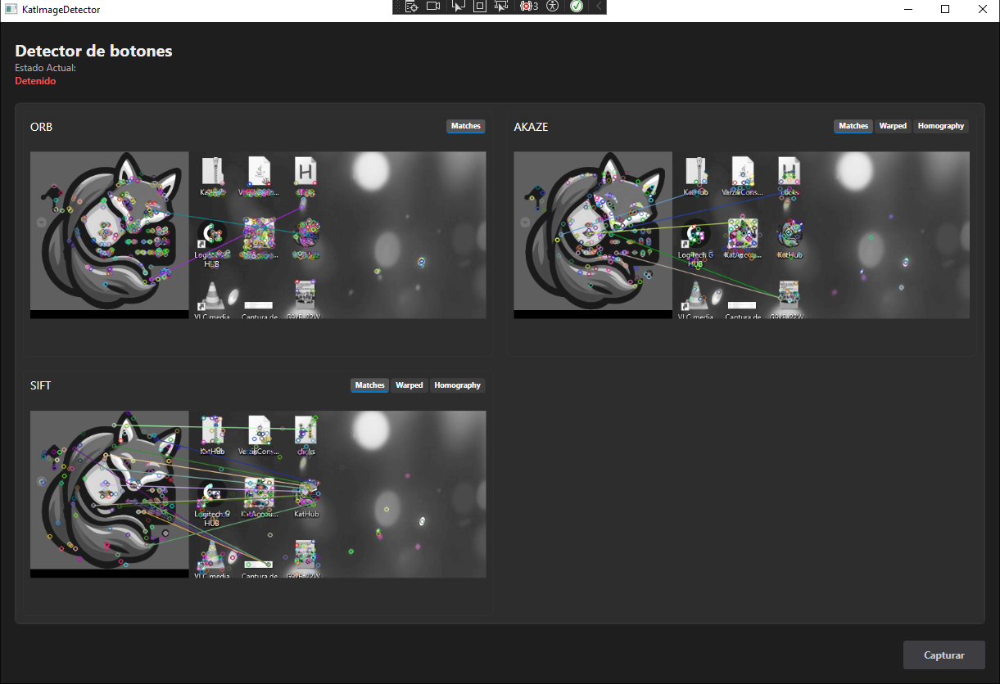

# KatImageDetector

A small WPF utility that captures the screen and tries to find a target image using two approaches: simple OpenCV Template Matching and ORB feature matching (via Emgu CV). Results are shown in the UI and a TemplateMatching result image is saved to Desktop/KatLol.

## Features
- Screen capture of the primary display

- Template matching (MatchTemplate)

- ORB feature detection + BFMatcher (KNN + Lowe ratio test)

- Visual debugging: match images displayed with OpenCV imshow (configurable in code)

- Saves template-match result to Desktop/KatLol with timestamp

## Requirements
- Windows (WPF UI + System.Windows.Forms screen capture)
- .NET (open the solution in Visual Studio; project targets a recent .NET desktop framework)
- Emgu.CV NuGet packages (Emgu.CV, Emgu.CV.runtime.windows and dependencies)

Install dependencies via NuGet in Visual Studio:
```
# example (adjust package versions to match the project)
Install-Package Emgu.CV
Install-Package Emgu.CV.runtime.windows
```

## Build & Run
1.	Open the solution in Visual Studio.
2.	Restore NuGet packages.
3.	Build and run the WPF project.
4.	Press the "Capture" button to take a screenshot and run both detectors.

